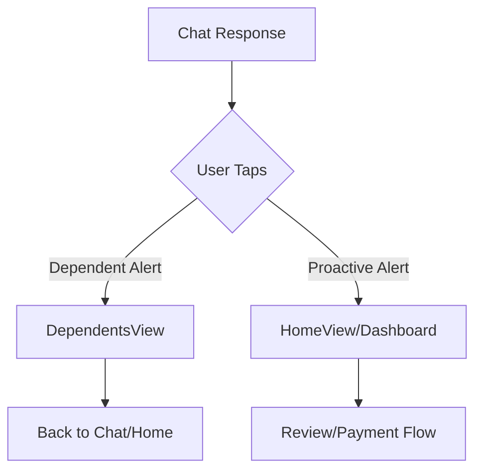

# Design Document: Dependent Alerts Feature

## Overview

This feature extends the Absher chatbot to display alerts about dependents (تابعين) alongside the user's own proactive alerts. When the chatbot responds to a proactive alert, it will show an additional message about a dependent's upcoming service deadline. The feature introduces differentiated navigation: tapping a dependent alert navigates to a new Dependents Page, while tapping the user's proactive alert navigates to the Dashboard.

## Architecture

The feature follows the existing MVVM architecture pattern:

```
┌─────────────────────────────────────────────────────────────┐
│                      AbsherChatView                         │
│  ┌─────────────────┐  ┌─────────────────────────────────┐  │
│  │ Main Response   │  │ Dependent Alert Message         │  │
│  │ + Deep Link     │  │ + Deep Link (to Dependents)     │  │
│  └─────────────────┘  └─────────────────────────────────┘  │
└─────────────────────────────────────────────────────────────┘
                              │
                              ▼
┌─────────────────────────────────────────────────────────────┐
│                     ChatViewModel                           │
│  - generateResponse() adds dependent alert message          │
│  - handleDeepLinkTap() returns navigation destination       │
└─────────────────────────────────────────────────────────────┘
                              │
                              ▼
┌─────────────────────────────────────────────────────────────┐
│                      AppViewModel                           │
│  - navigateToDependents() - new navigation method           │
│  - Screen.dependents - new screen case                      │
└─────────────────────────────────────────────────────────────┘
```

## Components and Interfaces

### 1. Dependent Model (New)

```swift
struct Dependent: Identifiable, Codable, Equatable {
    let id: UUID
    let name: String
    let relationship: String  // e.g., "ابن", "ابنة"
    let serviceType: String
    let daysRemaining: Int
    
    var alertMessage: String {
        "\(relationship) \(name) باقي له \(daysRemaining) يوم على \(serviceType)"
    }
}
```

### 2. Extended ServiceType Enum

```swift
enum ServiceType: String, Codable, Equatable, CaseIterable {
    case drivingLicenseRenewal = "driving_license_renewal"
    case passportRenewal = "passport_renewal"
    case nationalIdRenewal = "national_id_renewal"
    case dependents = "dependents"  // New case
}
```

### 3. Extended DeepLink

The existing DeepLink struct will support the new `dependents` service type without modification.

### 4. ChatViewModel Extensions

```swift
extension ChatViewModel {
    /// Creates a dependent alert message after the main response
    func createDependentAlertMessage(for dependent: Dependent) -> ChatMessage
    
    /// Gets mock dependent data (to be replaced with real data service)
    func getActiveDependentAlert() -> Dependent?
}
```

### 5. AppViewModel Extensions

```swift
extension AppViewModel {
    /// New screen case
    enum Screen {
        // ... existing cases
        case dependents
    }
    
    /// Navigate to dependents page
    func navigateToDependents()
}
```

### 6. DependentsView (New)

A new SwiftUI view displaying the list of dependents with their service statuses.

## Data Models

### Dependent

| Field | Type | Description |
|-------|------|-------------|
| id | UUID | Unique identifier |
| name | String | Dependent's name (e.g., "حسام") |
| relationship | String | Relationship type (e.g., "ولدك") |
| serviceType | String | Service description (e.g., "اصدار رخصة") |
| daysRemaining | Int | Days until deadline |

### Navigation Flow



## Correctness Properties

*A property is a characteristic or behavior that should hold true across all valid executions of a system-essentially, a formal statement about what the system should do. Properties serve as the bridge between human-readable specifications and machine-verifiable correctness guarantees.*

### Property 1: Dependent alert message contains required information
*For any* dependent with a name and days remaining, the generated alert message SHALL contain both the dependent's name and the days remaining value.
**Validates: Requirements 1.2**

### Property 2: Dependent alert messages have navigation deep links
*For any* dependent alert message created by the system, the message SHALL have a non-nil deep link with service type `dependents`.
**Validates: Requirements 1.1, 1.3**

### Property 3: Dependent deep link navigates to dependents destination
*For any* deep link with service type `dependents`, handling the deep link tap SHALL return the dependents navigation destination.
**Validates: Requirements 2.1**

### Property 4: Proactive alert deep link navigates to dashboard
*For any* deep link with service type `drivingLicenseRenewal`, `passportRenewal`, or `nationalIdRenewal`, handling the deep link tap SHALL return the review/dashboard navigation destination.
**Validates: Requirements 2.2**

### Property 5: Dependents page displays all dependent information
*For any* list of dependents, the dependents page rendering SHALL include each dependent's name, service type, and days remaining.
**Validates: Requirements 3.1, 3.2**

## Error Handling

| Scenario | Handling |
|----------|----------|
| No dependents available | Do not display dependent alert message |
| Dependent data missing fields | Skip that dependent in the list |
| Navigation failure | Stay on current screen, log error |

## Testing Strategy

### Property-Based Testing Framework
- **Framework**: SwiftCheck (Swift property-based testing library)
- **Minimum iterations**: 100 per property test

### Unit Tests
- Test Dependent model initialization and alertMessage computed property
- Test ServiceType enum includes dependents case
- Test DeepLink creation with dependents service type
- Test ChatViewModel.createDependentAlertMessage()
- Test AppViewModel.navigateToDependents()

### Property-Based Tests
Each correctness property will be implemented as a property-based test:

1. **Property 1 Test**: Generate random Dependent instances, verify alertMessage contains name and daysRemaining
2. **Property 2 Test**: Generate dependent alert messages, verify all have non-nil deep links with correct service type
3. **Property 3 Test**: Generate deep links with dependents type, verify navigation returns correct destination
4. **Property 4 Test**: Generate deep links with proactive alert types, verify navigation returns review destination
5. **Property 5 Test**: Generate random dependent lists, verify rendered output contains all required fields

### Test Annotations
All property-based tests will be annotated with:
```swift
// **Feature: dependent-alerts, Property {number}: {property_text}**
```
