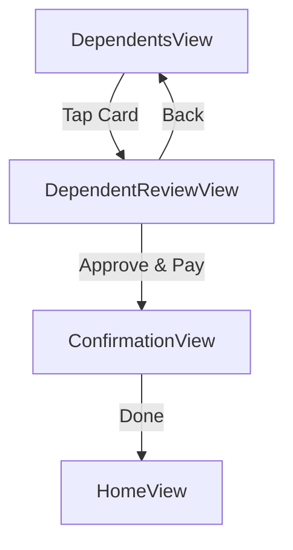

# Design Document: Dependent Service Payments Feature

## Overview

This feature extends the Absher app to allow users to pay for their dependents' services directly from the Dependents Page. When a user taps on a dependent's card (e.g., حسام or سارة), they navigate to a review/payment page that shows the service details and allows them to approve and pay for the service.

## Architecture

The feature follows the existing MVVM architecture pattern and reuses components from the existing ReviewView:

```
┌─────────────────────────────────────────────────────────────┐
│                      DependentsView                         │
│  ┌─────────────────┐  ┌─────────────────────────────────┐  │
│  │ DependentCard   │  │ DependentCard                   │  │
│  │ (Tappable)      │  │ (Tappable)                      │  │
│  └────────┬────────┘  └────────────────┬────────────────┘  │
└───────────┼────────────────────────────┼────────────────────┘
            │                            │
            ▼                            ▼
┌─────────────────────────────────────────────────────────────┐
│                   DependentReviewView                       │
│  - Dependent header (name, relationship)                    │
│  - Service details (type, fees, days remaining)             │
│  - Approve/Pay button                                       │
└─────────────────────────────────────────────────────────────┘
                              │
                              ▼
┌─────────────────────────────────────────────────────────────┐
│                      AppViewModel                           │
│  - selectedDependent: Dependent?                            │
│  - navigateToDependentReview(dependent:)                    │
│  - approveDependentService()                                │
└─────────────────────────────────────────────────────────────┘
```

## Components and Interfaces

### 1. Extended Dependent Model

Add fee amount to the Dependent model:

```swift
struct Dependent: Identifiable, Codable, Equatable {
    let id: UUID
    let name: String
    let relationship: String
    let serviceType: String
    let daysRemaining: Int
    let feeAmount: Double  // New: fee for the service
    
    var serviceTitle: String {
        "\(serviceType) - \(name)"
    }
}
```

### 2. Extended AppViewModel

```swift
extension AppViewModel {
    /// Currently selected dependent for review/payment
    @Published var selectedDependent: Dependent?
    
    /// Navigate to dependent review page
    func navigateToDependentReview(dependent: Dependent)
    
    /// Approve and pay for dependent's service
    func approveDependentService()
}
```

### 3. DependentReviewView (New)

A new SwiftUI view similar to ReviewView but tailored for dependent services:

```swift
struct DependentReviewView: View {
    @ObservedObject var viewModel: AppViewModel
    let dependent: Dependent
    
    // Shows:
    // - Dependent header (name, relationship, avatar)
    // - Service type and days remaining
    // - Fee amount
    // - Approve/Pay button
}
```

### 4. Updated DependentCard

Make the existing DependentCard tappable with navigation action:

```swift
struct DependentCard: View {
    let dependent: Dependent
    let onTap: () -> Void  // New: tap action
}
```

## Data Models

### Extended Dependent

| Field | Type | Description |
|-------|------|-------------|
| id | UUID | Unique identifier |
| name | String | Dependent's name (e.g., "حسام") |
| relationship | String | Relationship type (e.g., "ولدك") |
| serviceType | String | Service description (e.g., "اصدار رخصة") |
| daysRemaining | Int | Days until deadline |
| feeAmount | Double | Fee for the service in SAR |

### Navigation Flow



## Correctness Properties

*A property is a characteristic or behavior that should hold true across all valid executions of a system-essentially, a formal statement about what the system should do. Properties serve as the bridge between human-readable specifications and machine-verifiable correctness guarantees.*

### Property 1: Tapping dependent card navigates to review page
*For any* dependent card tap action, the app SHALL navigate to the dependent review screen with the correct dependent selected.
**Validates: Requirements 1.1, 1.2**

### Property 2: Dependent review page displays all required information
*For any* dependent, the review page SHALL display the dependent's name, relationship, service type, fee amount, and days remaining.
**Validates: Requirements 2.1, 2.2, 2.3, 2.4**

### Property 3: Payment button shows correct fee amount
*For any* dependent with a fee amount, the payment button text SHALL contain the fee amount value.
**Validates: Requirements 3.4**

### Property 4: Successful payment navigates to confirmation
*For any* successful payment action, the app SHALL navigate to the confirmation screen.
**Validates: Requirements 3.2**

## Error Handling

| Scenario | Handling |
|----------|----------|
| Dependent has no fee amount | Display default fee or disable payment |
| Payment fails | Show error message, stay on review page |
| Navigation failure | Stay on current screen, log error |

## Testing Strategy

### Property-Based Testing Framework
- **Framework**: Swift Testing with parameterized tests
- **Minimum iterations**: 100 per property test

### Unit Tests
- Test Dependent model with feeAmount property
- Test AppViewModel.navigateToDependentReview()
- Test AppViewModel.approveDependentService()
- Test DependentReviewView initialization

### Property-Based Tests
Each correctness property will be implemented as a property-based test:

1. **Property 1 Test**: Generate random dependents, verify navigation sets correct selectedDependent
2. **Property 2 Test**: Generate random dependents, verify review page contains all required fields
3. **Property 3 Test**: Generate random fee amounts, verify button text contains the amount
4. **Property 4 Test**: Verify payment completion navigates to confirmation

### Test Annotations
All property-based tests will be annotated with:
```swift
// **Feature: dependent-service-payments, Property {number}: {property_text}**
```

